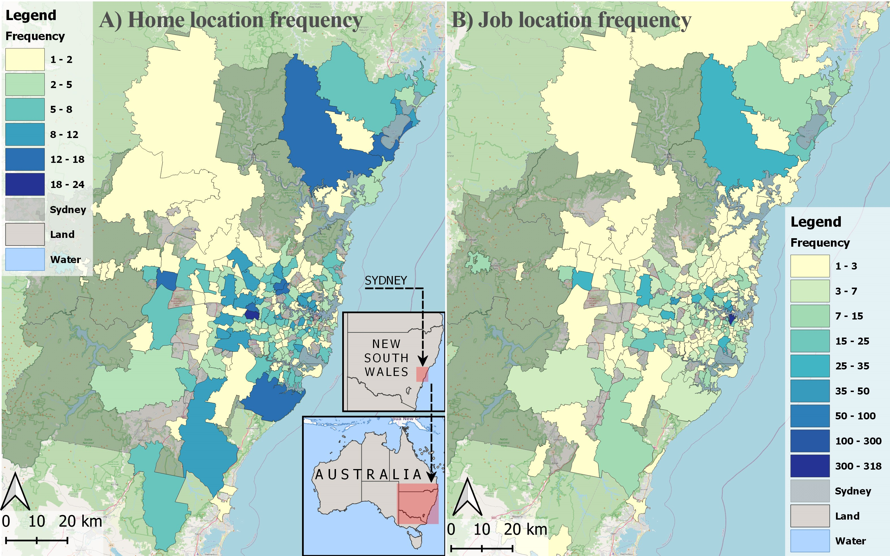
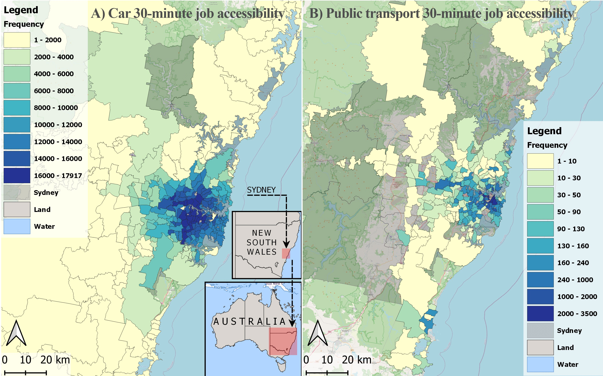
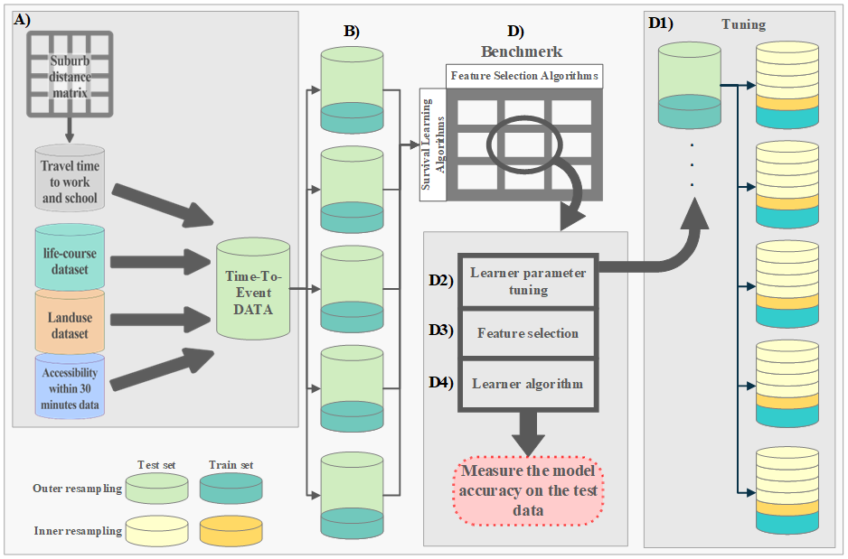

<!-- README.md is generated from README.Rmd. Please edit that file -->

# Machine Learning vs Conventional Specifications for Housing Relocation Decisions

<!-- badges: start -->
<!-- badges: end -->

Understanding the households’ residential relocation dynamics is of
great importance in urban land-use modeling. The duration of residence
at a location and its dependence on accessibility is one of the less
studied areas of residential relocation. Residential relocation duration
data is usually modeled using classical survival analysis approaches.
The last few years’ huge progress in the field of data science and
machine learning has provided a fruitful opportunity for improving such
models and making the most out of the heterogenous and high-dimensional
residential relocation data. This study benchmarks the performance of
ten machine learning approaches combined with six feature selection
methods that are capable of handling survival data. The models are also
compared with parametric and non-parametric classical survival
approaches. The 30-minute accessibility of home locations to job
opportunities and accessibility of household to workplace and education
locations were estimated and included. The residential self-selection
issue is also addressed by incorporating the direct questioning
approach. A comprehensive life-course dataset of 1,024 residential
relocations in the metropolitan area of Sydney, Australia is utilized. A
linear model on the households’ tendency to increase/decrease their
accessibility after relocation, revealed important policy implications
including reemphasizing the importance of public transport equity and
scattering job opportunities for a more sustainable environment and
human well-being. Using a concordance index measurement, the results
indicate that classical approaches could reach 52% accuracy without any
feature selection and 76% With feature selection approaches, while
machine learning approaches have generally a high-performance accuracy
regardless of the learner and feature selector.

# Data

A retrospective survey of residential relocation in Sydney, Australia,
containing household unit members’ socio-demographic information,
vehicle ownership, occupation, and education records. The data cannot be
made publicly available due to its confidentiality agreement. The below
figure presents the frequency of home and job locations of the
households in the metropolitan area of Sydney.

The accessibility measures are calculated for each suburb in Sydney. A
heatmap of the accessibility measure for both car and public transport
is presented in the below figure.

# Data descriptive statistics

The dataset contains a huge number of variables (features) that cannot
all be included here. However, a list of some of the variables with
their mean and standard deviation values are provided in the below
table. Please note that the survey is conducted in both Sydney,
Australia and Chicago, US and both are included in this table for the
ease of comparison.

# Machine learning algorithms

In this study, 10 machine learning algorithms are included and compared
to three widely-used classical survival analysis methods. All the
learners are as follows:

## Classical models:

\[1\] Cox Proportional Hazard (Cox-PH)-non-parametric \[2\]
Weibull-based Accelerated Failure Time (AFT) parametric \[3\]
Lognormal-based Accelerated Failure Time (AFT) parametric

## Machine learners

\[1\] Cross-validation regularized cox proportional-hazards models
(cv.glmnet)

1.  Ridge regularization  
2.  Lasso regularization  
3.  Elastic net regularization  
    \[2\] Gradient boosting methods  
4.  Survival gradient boosting model (GBM)  
5.  Boosted generalized linear survival model (GLMBoost)  
6.  Extreme gradient boosting survival model (Tree-based) also listed in
    4.  
7.  Extreme gradient boosting survival model (Linear based)  
    \[3\] Survival tree model  
8.  rpart  
9.  Extreme gradient boosting survival model (Tree-based)also listed in
    b.  
    \[4\] Random forest models  
10. Survival random forest SRC (RFSRC)  
11. Ranger survival model

# Feature selection algorithms

Feature selection methods uses in this study are as follows:  
\[1\] The univariate model score  
\[2\] Minimum redundancy, maximum relevance (MRMR)

### Random Forest methods:

\[3\] feature importance  
\[4\] minimal depth  
\[5\] feature hunting  
\[6\] ranger impurity

# Machine learning pipeline

# Code

`Targets` package is used in this study for arranging a pipeline for all
the study steps from the data preparation to data analysis. Two
pipelines are included in this study, (1) the accessibility pipeline
(`accessibility_targets.R`) and (2) the main pipeline (`_targets.R`).
The accessibility command includes the process of retrieving raw data
(i.e., land-use, transportation network, and OSM data), finding each
suburbs’ land-use status, households’ travel time to work and school
using car and public transport, and calculating the 30-minute
accessibility of each suburb members to jobs. The main pipeline includes
the data preparation, model preparations, regression modelling, machine
learning benchmark, and post-processing steps. `tar_make()` command can
be used for running each pipeline.
